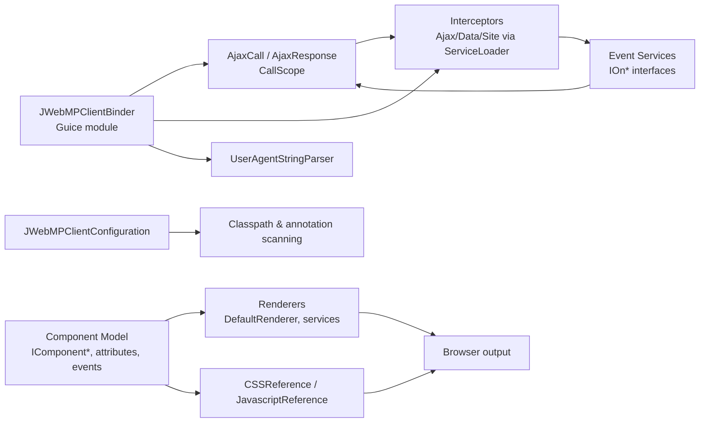

# C4 Level 3 — Components (JWebMP Client Library)

**Key interactions**
- `JWebMPClientBinder` wires call-scoped AJAX request/response objects and locator keys for interceptors, exposing UA detection to consumers.
- `JWebMPClientConfiguration` configures the GuicedEE environment to scan annotations and ignore visibility limits.
- The Component Model defines HTML elements, attributes, events, and lifecycle hooks that render via `DefaultRenderer` and attach script/style references.
- Interceptors wrap AJAX calls before/after invoking event services, populating `AjaxResponse` for the browser.
