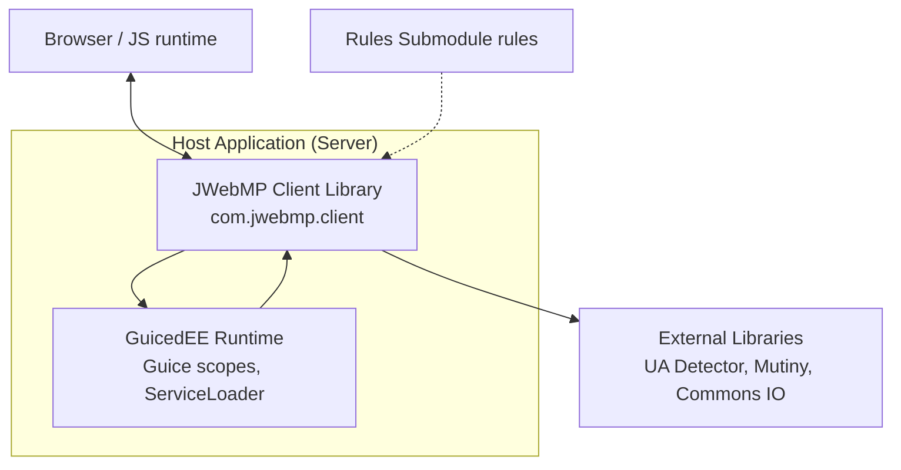

# C4 Level 2 — Containers

**Container responsibilities**
- **JWebMP Client Library:** Models HTML components/attributes, renders pages, and handles AJAX calls/responses; exposes JPMS exports for consumers.
- **GuicedEE Runtime:** Provides DI scopes (`CallScope`), loads interceptors (`AjaxCallIntercepter`, `DataCallIntercepter`, `SiteCallIntercepter`) via service loader, and applies configuration from `JWebMPClientConfiguration`.
- **Browser:** Emits events and receives rendered pages/AJAX responses.
- **Rules Submodule:** Documentation source of truth; not part of runtime.
- **External Libraries:** User-agent detection, reactive utilities, and IO helpers consumed by the client library.
