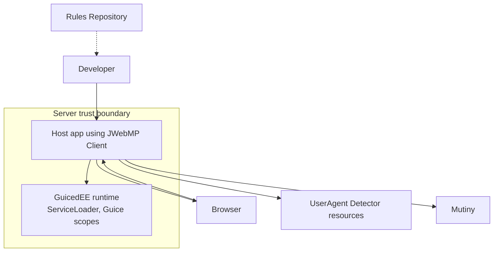

# C4 Level 1 — Context

**Notes**
- System under design: the `com.jwebmp.client` library embedded into host apps to render HTML/JS and handle AJAX flows.
- Trust boundaries: Browser inputs are untrusted; interceptors validate/transform before producing `AjaxResponse`.
- Dependencies: GuicedEE provides DI/binder loading; UA Detector parses user-agent strings; Mutiny supplies reactive primitives.
