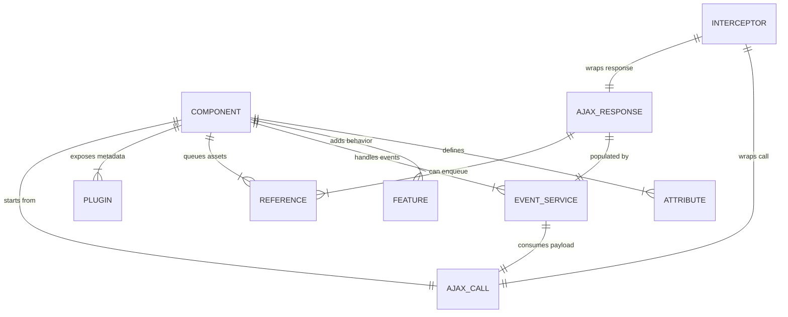

# ERD — Component Model Relationships

**Coverage**
- Maps core types in `com.jwebmp.core.base.*` (components, attributes, features), event services (`com.jwebmp.core.events.services.*`), AJAX request/response objects, and interception hooks.
- References represent CSS/JS resources emitted during rendering (`CSSReference`, `JavascriptReference`).
