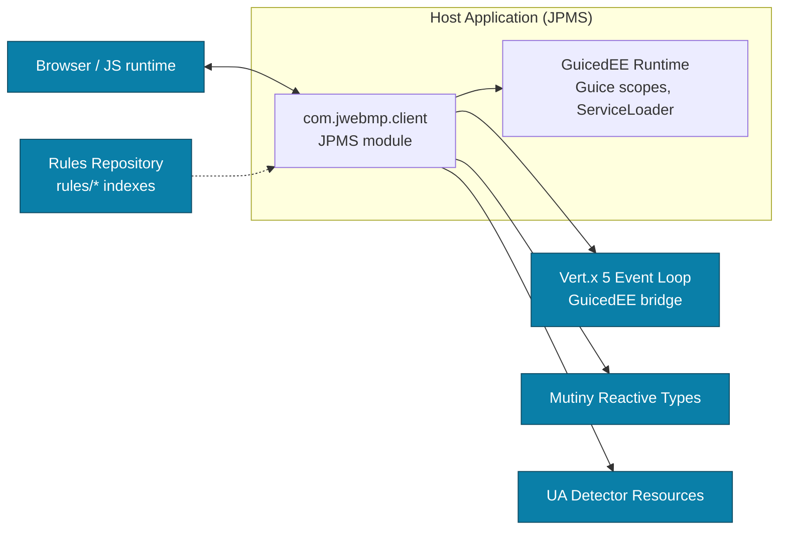

# Dependency & Integration Map — JWebMP Client

**Notes**
- `com.jwebmp.client` is packaged as a JPMS module; exports/opens are defined in `src/main/java/module-info.java` to support renderers and serialization.
- GuicedEE provides DI scopes (`CallScope`), ServiceLoader interception keys, and bridge modules for Vert.x 5 event loops.
- Mutiny is the preferred reactive API for asynchronous interactions; avoid mixing with other reactive libraries.
- UA Detector is consumed for user-agent parsing to tailor responses; keep resources available on the classpath.
- The Rules Repository supplies authoritative generation and documentation policies; do not place project docs inside the `rules/` submodule.
