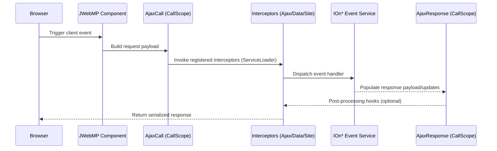

# Sequence — AJAX Call Pipeline

**Flow notes**
- `AjaxCall` and `AjaxResponse` are bound per request via `CallScope` from GuicedEE.
- Interceptors are discovered through `JWebMPInterceptionBinder` keys and can short-circuit or augment the response.
