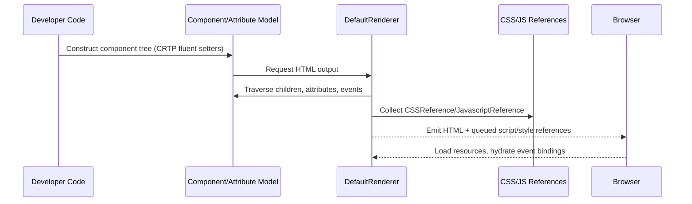

# Sequence — Component Render Lifecycle

**Flow notes**
- The component model relies on fluent setters returning the component type (CRTP) instead of builders.
- Renderers respect JPMS exports and open packages declared in `module-info.java` for JSON serialization.
