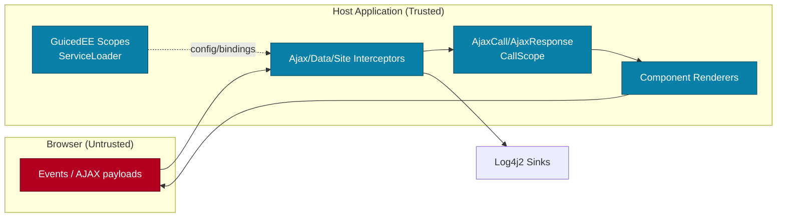

# Threat Model — JWebMP Client

**Trust boundaries and mitigations**
- Browser inputs are untrusted; validation occurs in interceptors and event services before touching the component tree or serialization.
- `CallScope`-bound `AjaxCall`/`AjaxResponse` isolates per-request data; avoid storing user data in singletons or static caches.
- Interceptors discovered via `JWebMPInterceptionBinder` must be idempotent and defensive; short-circuit malformed payloads and sanitize serialized responses.
- Logging uses Log4j2 defaults (per GuicedEE rules); redact secrets and user PII in all log statements.
- GuicedEE configuration (`JWebMPClientConfiguration`) controls classpath scanning; restrict visibility to intended packages and review custom modules for JPMS exports.
